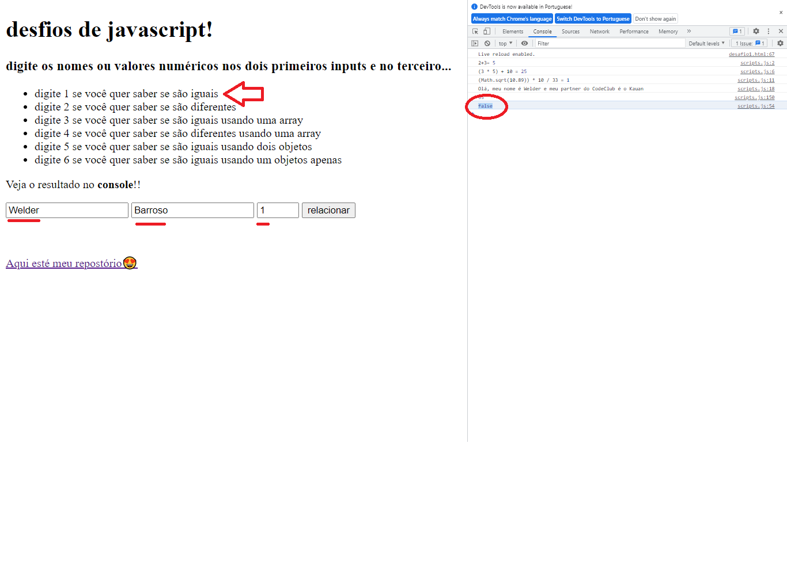

<h1>Primeiro Desafio de javascript</h1>

 Este desafio foi proposto pelo mentor Rodolfo Mori do curso Code Clube, mas sua execução foi feita interamente sem sua ajuda direta, contando apenas com seus conhecimentos já passados ao longo do curso.
 

 O programa disponibiliza uma interface feita com html com intruções para o preenchimento dos inputs com nomes ou números e a escolha do método de comparação usando números no terceiro input.
 
 
O projeto ainda está em desenvolvimento e as próximas atualizações serão voltadas nas seguintes tarefas:

- [ ] estilizar o programa com CSS;
- [ ] botar um painel com os código do método escolhido para comparação;
- [ ] sua sugestão...
- [ ] sua sugestão...
- [ ] sua sugestão...
